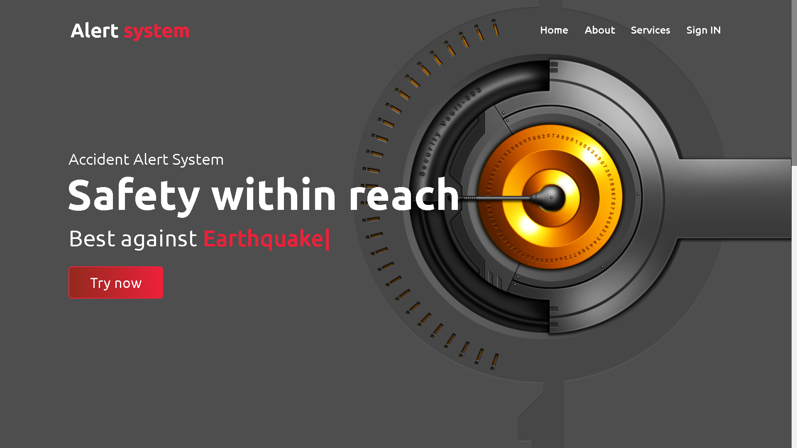

# Alert System Web Design Project



Welcome to the **Alert System Web Design Project**! This repository houses a simple yet engaging promotional website designed to showcase our innovative emergency alert system.

## Features

- **Intuitive Interface**: User-friendly design for seamless navigation.
- **Responsive Design**: Optimized for both desktop and mobile devices.
- **Clear Call-to-Action**: Encourages users to learn more and engage with our service.

## Getting Started

To view the website, simply clone this repository and open `index.html` in your browser.

```bash
git clone https://github.com/HorikitaSuzuneTsundere/Alert-System-Web-Design.git
```

## Technologies Used

- HTML
- CSS
- JavaScript

## Contributing

We welcome contributions! Please feel free to submit issues or pull requests to enhance the project.

## License

This project is licensed under the MIT License.
